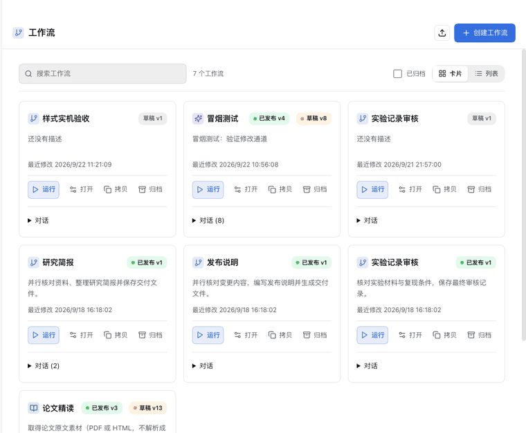

# dsh-plugin-workflow

DeepSeek Harness 的可插拔工作流 Studio。侧栏只有一个“工作流”入口：点击在主界面打开工作流面板（卡片或列表两种样式），再点一次回到对话。每个工作流保存不可变版本，它的对话显示在面板中对应的工作流下。任意会话也可输入 `/workflow` 选择或创建工作流。

## 宿主支持

本目录维护 DSH Omni 集成版。插件数据落在 Omni 的 `$DSH_HOME`（`config.dshHome` → `DSH_HOME` → `~/.dsh`），工作流定义、运行记录和附件保存在独立的 `workflow-studio` 目录。

客户端通过 Harness 的工作流面板、输入标签和会话槽集成。步骤内复用原生对话组件，包含消息、思考过程和工具调用。嵌入步骤视图与 Omni 的 `0.1.7-rc.2` 运行时一同验收。

包显式导出 `./package.json`：DSH Desktop 的宿主在 Electron Utility 进程里通过 Node loader 的 fallback 路径解析客户端入口，未声明该导出时客户端入口会被静默跳过；普通 Web 宿主不受影响。该导出对两端都保留。

## 对话式运行与调试


演示使用隔离环境与合成材料，展示 Notebook 步骤、输入编辑、附件卡片和结果检视。

- 步骤正文左对齐显示，以低饱和度背景区分；输入使用消息气泡与附件卡片，输出保留结论与文件，执行过程缩进折叠。
- 在工作流编辑器选择逐步调试，运行页顶选择消息接收者，运行、暂停独立控制。关闭面板、隐藏或刷新页面后可恢复执行现场。
- 步骤上方图标依次提供运行、编辑输入、打开步骤会话、更新输出和准备后续步骤；悬停或键盘聚焦可识别操作。
- 总会话与独立步骤页均可编辑 prompt 和添加文件。编辑仅保存到本次运行；运行图标执行选定步骤，依赖它的下游结果过期。
- 上传支持图片预览与文件卡片，每步最多 12 个附件、单次上传合计 8 MiB。直接上游输出中的文件自动作为下一步附件传入；同一文件按内容标识去重。
- 调试每次执行一个已就绪节点，内部最多 8 个子代理并行，各有独立会话与模型配置。步骤会话可继续交流并返回总会话。
- 更新输出图标将最新回答保存为步骤输出，回退依赖步骤的公共文件改动；随后选择单步或连续执行。
- 每个步骤和尝试在本地保留输入、输出、快照、精确二进制 patch 和文本 unified diff。公共工作目录直接修改；回退前检查文件哈希和权限。

构建与桌面验收结果见 [Omni 工作流 0.4.0 验收记录](https://github.com/hzxwonder/dsh-omni/blob/main/docs/workflow-omni-0.4.0.md)。

快照覆盖常规文件，单次上限 128 MiB / 20,000 个文件，排除 `.git`、`node_modules`、符号链接和内部检查点。网络请求、部署及其他外部副作用需单独核对。多个子代理直接写同一文件的过程冲突尚未自动仲裁；同一公共根目录的不同 workflow 串行占用。运行中的补充消息支持文本；补充附件通过步骤输入编辑后重新执行。外部执行器的一次性会话能力与内置 spawn 不同。

所有运行材料、快照和对话保存在本地 DSH home；模型调用会向所配置的 provider 发送任务内容。仓库演示使用合成材料，原始运行数据库与快照不属于发布内容。

## 功能

- `/workflow` 原生弹出菜单：创建工作流，或对任一工作流选择“运行”（绑定当前会话）和“修改”（对话修改）
- 创建与修改会话在输入卡片显示工作流标签；运行会话通过页顶操作区推进步骤与选择消息接收者
- 面板提供卡片与列表两种样式：卡片显示描述、版本和最近修改，列表按列对齐；两种样式都能打开、运行、拷贝和归档
- 拷贝工作流：以最新一版定义新建一个未发布的草稿（名称加“副本”），运行记录、定时任务和会话绑定都不跟随
- “创建工作流”按钮直接进入对话：先描述目标，Agent 在对话中生成初步的工作流定义
- 工作流的对话显示在面板内对应卡片/行的“对话”里，使用同一组动作：更多操作（⋯）和新建会话（＋）
- 工作流对话落在 `$DSH_HOME/workflows/<id>`，对应原生工作区按用途命名：运行会话用工作流名，创作/修改会话用“工作流对话”；用户自己改过的名字不会被覆盖
- 对话创建、试运行和版本化修改
- 可视化编辑器：浮动步骤工具条、右侧 步骤/预览/控制台/主题 面板；顶部“对话修改”进入修改会话，“应用”视图包含运行记录、定时任务和版本历史
- 生成、用户输入、交互、输出、工具、条件、汇合、子工作流、确认、发布、脚本和 Multithread 步骤；双击步骤名称可原位修改
- Skill 与文件资源模块：按工作流版本保存标准 Skill 文件夹和导入文件，在指定 Prompt 位置插入路径，并加载连线 Skill 的指令。参见 [资源模块操作说明](docs/resource-nodes.md)。
- 步骤面板集中展示模型设置；Provider、Model 和推理强度可继承会话或逐步指定
- 交互节点：在绑定会话里向用户提问，用户回答后继续。`交互一次` 收一条回答（例如论文 PDF 或链接）；`交互目标` 由判定 Agent 反复追问，直到它理解用户意图并请用户确认后才进入下一步，可用 `maxTurns` 限定轮次；“已有材料时跳过提问”让已经带上材料的消息直接进入下一步。交互节点需要真人，定时无人值守的运行会以 `INTERACTION_UNATTENDED` 失败
- 节点级 executor、provider、model、effort、skills、工具白名单和输出 Schema
- 附件材料自动提取；论文精读模板按获取论文、撰写解读、读者问答评审、Halo 发布四个阶段执行

## 论文解读与评审循环


演示展示四阶段布局、评审循环设置及明暗主题和窄窗口状态，采用隔离测试数据。

`paper-explainer` 使用分层阅读模板，将原文转换为有具体例子、证据和适用边界的初学者文章。提问者读取原文和文章，回答者只接收文章和问题，审稿者结合原文与问答评分。85 分通过，最多三轮，未通过返回写作步骤；达到上限则保留现场供处理。

工作流定义通过 `repeat` 指定返回步骤、条件和轮数，以及延续原会话或新建会话。子代理支持 `dependsOn` 和独立 `input` 映射，无依赖成员继续并行执行。`repeat` 是有界回到上游步骤的评审循环。每轮文章与评审分别保存。

Halo 发布使用服务器已有发布脚本。管理员在 `$DSH_HOME/workflow-studio/halo-destination.json` 配置 `sshHost`、`helper` 和 `category`，将 `scripts/halo-publish.py` 放入站点 `scripts/` 目录。站点凭据留在服务器，仓库与工作流定义不包含凭据。先使用发布适配器的 `dryRun` 完成渲染预检；正式发布返回文章标识与网址，并核实公开页面响应。更新原文章时，在运行输入中提供 `publication: {slug, postId}`；发布前校验目标并备份原正文，返回相同文章标识。站点需具备 Markdown 渲染与发布脚本；公式和图片需要目标站点支持，不能将生成的文本路径视为已上传附件。
- 本地 Host 持久化定时任务，支持 IANA 时区、夏令时、错过执行和重叠策略
- SQLite WAL、乐观并发控制、运行事件、产物下载、暂停/恢复和权限检查

## 开发验证

```sh
npm install
npm run check:host
npm test
npm run check:web
```

`check:web` 在隔离临时 profile 启动 Harness，并使用本地合成 provider 验证侧栏入口与面板开关、卡片/列表两种样式、面板内对话、拷贝工作流、创建工作流进入对话、编辑器、运行记录和移动布局，不调用外部模型。

## 安装与卸载

在目标 Harness profile 中加入 `dsh-plugin-workflow` bundle，重启 Host。卸载时从 profile bundle 列表移除并重启；插件数据位于 `$DSH_HOME/workflow-studio`，删除该目录会移除工作流、版本、运行记录和产物。

定时任务只在本地 Host 在线时执行；生产环境应保留工作流 SQLite 目录并按部署策略备份。

### 历史对话

工作流卡片的「对话」列出已有消息或执行记录的会话。点击后进入原会话，保留消息和运行记录，可继续交流；「运行」用于开始一次新会话。未发送消息且没有执行记录的空会话不计入历史。

### Desktop 工作流

在工作流首页搜索任务，点击「运行」提供材料；「对话」可以继续历史会话。编辑器提供步骤列表和流程图，选中一步即可修改，双击名称可改名。「更多步骤」提供工具、条件、汇合、子工作流、确认、发布、脚本和 Multithread。修改完成后保存版本，再试运行验证。



动图展示总览、步骤列表、流程图和深色主题。[静态截图与验收记录](docs/desktop-ux-acceptance.md)提供可逐页阅读的版本。
